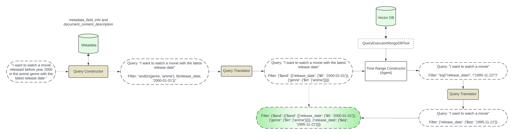
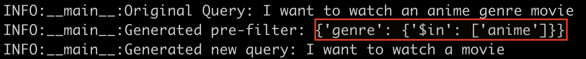
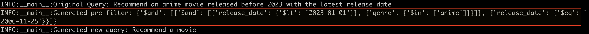

# SmartFilteringRAG

## Introduction

**Ever searched for "old black and white comedies" only to be bombarded with a mix of modern action flicks?** Frustrating, right? That's the challenge with traditional search engines - they often struggle to understand the nuances of our queries, leaving us wading through irrelevant results.

This is where Smart Filtering comes in. It's a game-changer that uses metadata and vector search to deliver search results that truly match your intent. Imagine finding exactly the classic comedies you crave, without the hassle.

We will dive into what Smart Filtering is, how it works, and why it's essential for building better search experiences. Let's uncover the magic behind this technology and explore how it can revolutionize the way you search.

## Understanding Vector Search

Vector search is a powerful tool that helps computers understand the meaning behind data, not just the words themselves. Instead of matching keywords, it focuses on the underlying concepts and relationships. Imagine searching for "dog" and getting results that include "puppy," "canine," and even images of dogs. That's the magic of vector search! 

How does it work? Well, it transforms data into mathematical representations called vectors. These vectors are like coordinates on a map, and similar data points are closer together in this vector space. When you search for something, the system finds the vectors closest to your query, giving you results that are semantically similar.

While vector search is fantastic at understanding context, it sometimes falls short when it comes to simple filtering tasks. For instance, finding all movies released before 2000 requires precise filtering, not just semantic understanding. This is where Smart Filtering comes in to complement vector search.

# The Challenge Of Semantic Search

While vector  brings us closer to understanding the true meaning of queries, there's still a gap between what users want and what search engines deliver. Complex search queries like "earliest comedy movies before 2000" can still be a challenge. Semantic search might understand the concepts of "comedy" and "movies," but it might struggle with the specifics of "earliest" and "before 2000."

This is where the results start to get messy. We might get a mix of old and new comedies, or even dramas that were mistakenly included. To truly satisfy users, we need a way to refine these search results and make them more precise. That's where pre-filters come into play.



Smart Filtering is the solution to this challenge. It's a technique that uses a dataset's metadata to create specific filters, refining search results and making them more accurate and efficient. By analyzing the information about your data, like its structure, content, and attributes, Smart Filtering can identify relevant criteria to filter your search.

Imagine searching for "comedy movies released before 2000." Smart Filtering would use metadata like genre, release date, and potentially even plot keywords to create a filter that only includes movies matching those criteria. This way, you get a list of exactly what you want, without the irrelevant noise. 

Let's dive deeper into how Smart Filtering works in the next section.


## How Smart Filtering Works

Smart Filtering is a multi-step process that involves extracting information from your data, analyzing it, and creating specific filters based on your needs. Let's break it down:
- **Metadata Extraction:** The first step is to gather relevant information about your data. This includes details like:
    - Data structure: How is the data organized (e.g., tables, documents)? 
    - Attributes: What kind of information is included (e.g., title, description, release date)?
    - Data types: What format is the data in (e.g., text, numbers, dates)?

- **Pre-filter Generation:** Once you have the metadata, you can start creating pre-filters.
These are specific conditions that data must meet to be included in the search results. For example, if you're searching for comedy movies released before 2000, you might create pre-filters for:
    - Genre: comedy 
    - Release date: before 2000

- **Integration with Vector Search:** The final step is to combine these pre-filters with your vector search. This ensures that the vector search only considers data points that match your pre-defined criteria.

By following these steps, Smart Filtering significantly improves the accuracy and efficiency of your search results.

## Understanding the Architecture
- **Metadata Extraction:** For the purpose of simplifying things, we will be using sample data and manually defining the metadata. Refer: [get_docs_metadata](rag/utils/prepare_test_data.py) in `prepare_test_data.py`.


- **Pre-filter Generation:** We will generate the pre-filters in two steps. 
  - Step 1: Metadata based Filter
  
    This step includes generating a filter based on the metadata. We will pass the user query and the metadata to a LLM and generate the metadata filter.
    
    We will use the [query_constructor](rag/metadata_filter.py) that is initialized with this [DEFAULT_SCHEMA_PROMPT](rag/prompts.py).
    > Note: Update the prompt and the few shot examples as per your use case.
    
    For example: If the metadata has `genre` and `release_date`, and user asks for `action` genre movies released before 2020, then we can use LLM to generate a filter like below:   
      ```{"$and": [{"genre": {"$in": ["anime"]}}, {"release_date": {"$lt": "2024-01-01"}}]}```
  - Step 2: Time based filtering 
  
    In this step, we will handle the cases where user asks for `latest`, `most recent`, `earliest` type of information. We will have to query the actual data to fetch this information.
    We will use LLM Agent in this step to query the mongodb collection using the executor tool: [QueryExecutorMongoDBTool](rag/tools.py)
    We are generating the time based filter in [generate_time_based_filter](rag/metadata_filter.py).
    We will also use the pre_filter generated in the first step in the `$match` in the aggregation stage.
    For example: If the user wants the latest movie, LLM agent will run below aggregation query using executor tool:
    ```
    Invoking: `mongo_db_executor` with `{'pipeline': '[{"$match": {"$and": [{"genre": {"$in": ["anime"]}}, {"release_date": {"$lt": "2024-01-01"}}]}}, { "$sort": { "release_date": -1 } }, { "$limit": 1 }, { "$project": { "release_date": 1 } }]'}`
    ```


- **Integration with Vector Search:** The generated pre-filter will be used with MongoDBAtlasVectorSearch retriever:
  ```bash
  retriever = vectorstore.as_retriever(
            search_kwargs={'pre_filter': pre_filter}
        )
  ```  


## Project Setup

Create a new python environment
```bash
python3 -m venv env
source env/bin/activate
```
Install the requirements
```bash
pip3 install -r requirements.txt
```
Set the configurations in [config.yaml](config/config.yaml)
```bash
database_name: <your database name>
collection_name: <your collection name>
vector_index_name: default
embedding_model_dimensions: 1536
similarity: cosine
model: gpt-4o
embedding_model: text-embedding-ada-002
```
Set the environment variables
```bash
export OPEN_AI_API_KEY = ""
export OPEN_API_BASE = ""
# headers are optional
export OPEN_API_DEFAULT_HEADERS=""

export MONGO_URI=""
```
Initialize the mongodb collection with sample data. 
This command will index some sample data and also create vector search index on the collection. 
```bash
python3 rag/initialize_mongo_collection.py
```

## Usage
```bash
python3 rag/main.py --queries <list of queries in json format>
```

## Example
```bash
python3 rag/main.py --queries '["I want to watch an anime genre movie", "Recommend a thriller or action movie release after Feb, 2010", "Recommend an anime movie released before 2023 with the latest release date"]'
```
Generated Pre_filters:

Input Query: ```"I want to watch an anime genre movie", "Recommend a thriller or action movie release after Feb, 2010"```

Output: 

Input Query: ```"Recommend a thriller or action movie release after Feb, 2010"```

Output: 

Input Query: ```"Recommend an anime movie released before 2023 with the latest release date"```

Output: 


## Benefits Of Smart Filtering

Smart Filtering brings a host of advantages to the table, making it a valuable tool for enhancing search experiences:
- **Improved Search Accuracy:** By precisely targeting the data that matches your query, Smart Filtering dramatically increases the likelihood of finding relevant results. No more wading through irrelevant information.

- **Faster Search Results:** Since Smart Filtering narrows down the search scope, the system can process information more efficiently, leading to quicker results.

- **Enhanced User Experience:** When users find what they're looking for quickly and easily, it leads to higher satisfaction and a better overall experience.

- **Versatility:** Smart Filtering can be applied to various domains, from e-commerce product searches to content recommendations, making it a versatile tool.

By leveraging metadata and creating targeted pre-filters, Smart Filtering empowers you to deliver search results that truly meet user expectations.

## Conclusion
Smart Filtering is a powerful tool that transforms  experiences by bridging the gap between user intent and  results. By harnessing the power of metadata and vector search, it delivers more accurate, relevant, and efficient search outcomes.

Whether you're building an e-commerce platform, a content recommendation system, or any application that relies on effective search, incorporating Smart Filtering can significantly enhance user satisfaction and drive better results.

By understanding the fundamentals of Smart Filtering, you're equipped to explore its potential and implement it in your projects. So why wait? Start leveraging the power of Smart Filtering today and revolutionize your search game!

## Credit
Inspired by LangChain's [Self Query Retriever](https://python.langchain.com/v0.1/docs/integrations/retrievers/self_query/mongodb_atlas/).
